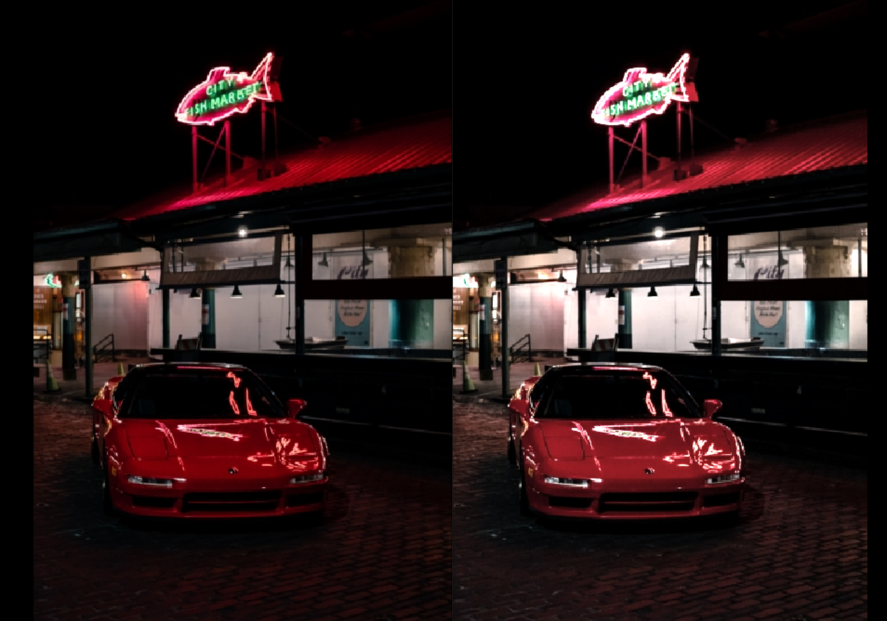

# PPM Image Editor
This program is able to edit PPM images with 6 user selected modifications. Modifications include:
- Inverting colors
- Greyscale conversion
- Removing red, green, or blue colors
- Increasing or decreasing brightness

### Usage  
Ensure that python 3.9 is installed.  
**Ensure that ppm file is in the same folder as python file**  
Run ppm-editor.py and follow instructions in terminal  
Directory should be included with filename  
Sample images are included
    
### Upcoming Updates
- Add modifications such as high/low brightness and high/low contrast
- Add ability to use more common image formats like JPEG

